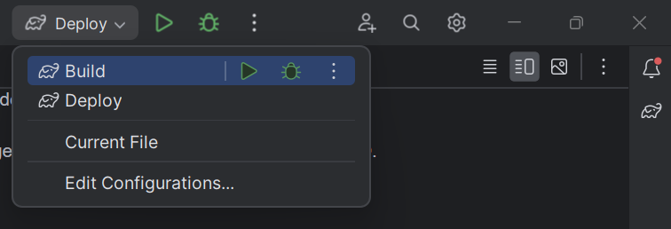
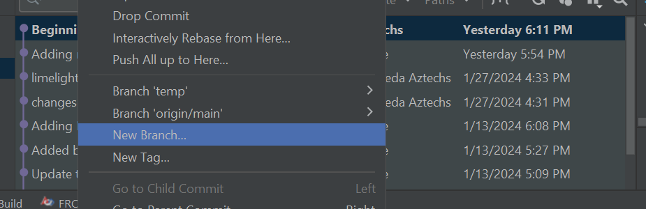

# [FRC-2024] Crescendo

## New robot checklist

- [ ] Check FRC Programming manual [link](https://docs.wpilib.org/en/stable/docs/zero-to-robot/introduction.html)
- [ ] Download WPI/NI Game Tools [link](https://docs.wpilib.org/en/stable/docs/zero-to-robot/step-2/frc-game-tools.html)
- [ ] Update Rio Software [link](https://docs.wpilib.org/en/stable/docs/zero-to-robot/step-3/imaging-your-roborio.html)
- [ ] Update CTRE Firmware [link](https://docs.ctre-phoenix.com/en/stable/ch03_PrimerPhoenixSoft.html)
  - [ ] Talons 
  - [ ] Victors
  - [ ] PD
- [ ] Calibrate CTRE Motor Controllers
  - [ ] Talons  [manual pdf, Chapter 2.2. PWM Calibration](https://store.ctr-electronics.com/content/user-manual/Talon%20SRX%20User's%20Guide.pdf)
  - [ ] Victors  [manual pdf, Page 10 Calibration](https://store.ctr-electronics.com/content/user-manual/Victor%20SPX%20User's%20Guide.pdf)
- [ ] Radio [link](https://docs.wpilib.org/en/stable/docs/zero-to-robot/step-3/radio-programming.html)
- [ ] Check for other hardware that needs update
- [ ] Update Gradle scripts and fix whatever is deprecated [link](https://github.com/wpilibsuite/GradleRIO)

## Build And Deploy

This project uses a gradle build system to build and deploy the software.

WPI libraries offer the [GradleRIO Plugin](https://github.com/wpilibsuite/GradleRIO) that packages and transfers the
artifacts to the RoboRIO.

### Build

To build via command line:

```shell
./gradlew build
```

This command may trigger dependency download before it starts to build.

### Deploy

Ensure the RoboRIO is connected to the build machine (USB or WIFI) and run:

```shell
./gradlew deploy
```

`deploy` will call `build` before it runs.

### Offline

If connecting the computer to the RoboRIO via WIFI, the internet access may be broken and the dependency
download will fail. Running `build` before `deploy` avoids the error. You can also try to use the `--offline` flag:

```shell
./gradlew deploy --offline
```

### IntelliJ

There are 2 `run configurations` to make it easy to build and deploy code to the robot.

* `Build`
* `Deploy`

The options are located at the top right part of the window:


## Code

Read the manuals!

* [Kotlin](https://www.jetbrains.com/pages/academy/kotlin/)
* [Basics](https://docs.wpilib.org/en/stable/docs/software/basic-programming/index.html)
* [Zero to Robot](https://docs.wpilib.org/en/stable/docs/zero-to-robot/introduction.html)
* [Overview](https://docs.wpilib.org/en/stable/docs/yearly-overview/index.html)
* [Control Systems Basics](https://docs.wpilib.org/en/stable/docs/software/advanced-controls/introduction/control-system-basics.html)

### Git Process

At the beginning of meetings AND before any new commits to main, pull main from remote repository (blue arrow)


If code is finished and ready for remote repository: commit and push

If code is not done yet, create a new branch



### Architecture

[Robot.kt](robot/src/main/kotlin/frc/robot/Robot.kt) is the entry point.

This project uses
a [TimedRobot](https://github.wpilib.org/allwpilib/docs/release/java/edu/wpi/first/wpilibj/TimedRobot.html)
with [Commands](https://docs.wpilib.org/en/stable/docs/software/commandbased/commands.html)
and [SubSystems](https://docs.wpilib.org/en/stable/docs/software/commandbased/subsystems.html) on top.

#### Timed Robot

The `Robot` class extends from `TimedRobot` which offers a few callback functions:

Power On:

* `robotInit`
* `robotPeriodic`

Autonomous Phase:

* `autonomousInit`
* `autonomousPeriodic`
* `autonomousExit`

Teleop Phase:

* `teleopInit`
* `teleopPeriodic`
* `teleopExit`

For [tests](https://docs.wpilib.org/en/stable/docs/software/basic-programming/using-test-mode.html):

* `testInit`
* `testPeriodic`
* `testExit`

`*Init` and `*Exit` functions are called by the system once per phase (`*Init` at the start and `*Exit` at the end),
the `*Perodic` functions are called at 50Hz (every 20 milliseconds) while the phase is active.

#### Command-Based Programming

Refs:

* [WPI](https://docs.wpilib.org/en/stable/docs/software/commandbased/index.html)

On top of the [TimedRobot](#timed-robot), the code is further subdivided or isolated into `Subsystems` and `Commands`.
This indirection should make the code more testable as code for specific functions of the robot are isolated.
Eg [TeleopDriveTest](robot/src/test/kotlin/frc/commands/drive/TeleopDriveTest.kt)

The [CommandScheduler](https://docs.wpilib.org/en/stable/docs/software/commandbased/command-scheduler.html) `run`
function is called on the `roboPeriodic` callback
in [Robot.kt](robot/src/main/kotlin/frc/robot/Robot.kt).

### Drivetrain

Refs

* [PIDs](https://docs.wpilib.org/en/stable/docs/software/advanced-controls/introduction/introduction-to-pid.html#introduction-to-pid)
* [DriveTrainSubsystem](robot/src/main/kotlin/frc/subsystems/DriveTrainSubsystem.kt)
* [TeleopDrive](robot/src/main/kotlin/frc/commands/drive/TeleopDrive.kt)
* [Autonomous?] TODO()

#### Motor Controllers:

The drive train run on 4 SparkMAX motor controllers (2 on each side) linked to brushless motors. The related CAN ids are
set in `DriveTrainSubsystem`

| CAN id | Subsystem  | Inverted | lead | Side  |
|--------|------------|----------|------|-------|
| 8      | Drivetrain | true     | yes  | left  |
| 9      | Drivetrain | true     | 8    | left  |
| 10     | Drivetrain | false    | 11   | right |
| 11     | Drivetrain | false    | yes  | right |

#### Commands

##### Teleop

During the teleop phase the drivetrain is controlled by the `TeleopDrive` Command.
This command is started in [Robot.kt](robot/src/main/kotlin/frc/robot/Robot.kt) `Robot.teleopInit()` and canceled in
`Robot.teleopExit()`

##### Autonomous

[TODO]

#### Sensors

**NOTE:** All motors have encoders builtin.

### Shooter And Intake

[DRAFT]

#### Motor Controllers:

The shooter run on 2 SparkMAX motor controllers. The intake run on 1 SparkMAX motor controller.

| CAN id | Subsystem | Inverted | lead | Side   |
|--------|-----------|----------|------|--------|
| 12     | shooter   | false    | yes  | top    |
| 13     | shooter   | false    | 12   | bottom |
| 15     | intake    | false    | -    | -      |

#### Sensors

**NOTE:** All motors have encoders builtin.

| DIO | Subsystem | Sensor              |
|-----|-----------|---------------------|
| ?   | intake    | Beambreakes? Color? |

#### Commands

[TODO]

Intake
* RunMotors(intake)
  * until(PresenceTrigger)

Shoot
* Await(PresenceTrigger) // can also add alignment signal from limelight
  * delay(SomeTime)
  * cancel(All)
* RunMotors(shooter, TargetSpeed)
* Await(SpeedTrigger(shooter.encoder) == TargetSeed)
  * then(RunMotors(intake))

### Shooting And Intake Assistant

[DRAFT]

General steps for shooting:
1. `Shoot` trigger is firing 
    * ignore is the [`presence sensor`](#sensors-1) is **not firing**
2. Keep aligning the target. Using a limelight:
    * measure orientation to target to feed a PID to alight the drivetrain to the target
    * measure distance to target to feed a PID that approaches the drivetrain to the target
3. Speed the shooter
    * use the encoders and PIDs in the SparkMAXes to accelerate and keep speed on the shooter motors
4. Speed the intake motor when speed is on the expected speed threshold

For alignment:
* Considering the 2 April tags can be captured
  * Get the midpoint between the tags
  * this is the setpoint for the PID
* Considering only one can be captured
  * set for one of them
  * get the center of the tag
  * this + and offset (in space) is the setpoint for the PID 

General steps for intake:
1. `Intake` trigger is firing
    * ignore is the [`presence sensor`](#sensors-1) is **firing**
2. Keep aligning the target. Using a limelight:
    * measure orientation to target to feed a PID to alight the drivetrain to the target
    * measure distance to target to feed a PID that approaches the drivetrain to the target
3. Speed the intake motor
4. Stop the intake motor when the [`presence sensor`](#sensors-1) trigger fires

### LED feedback

[Draft]

#### Peripherals

| DIO | Subsystem   | Device    |
|-----|-------------|-----------|
| ?   | LEDFeedback | LED Strip |

#### Commands

[TODO]
